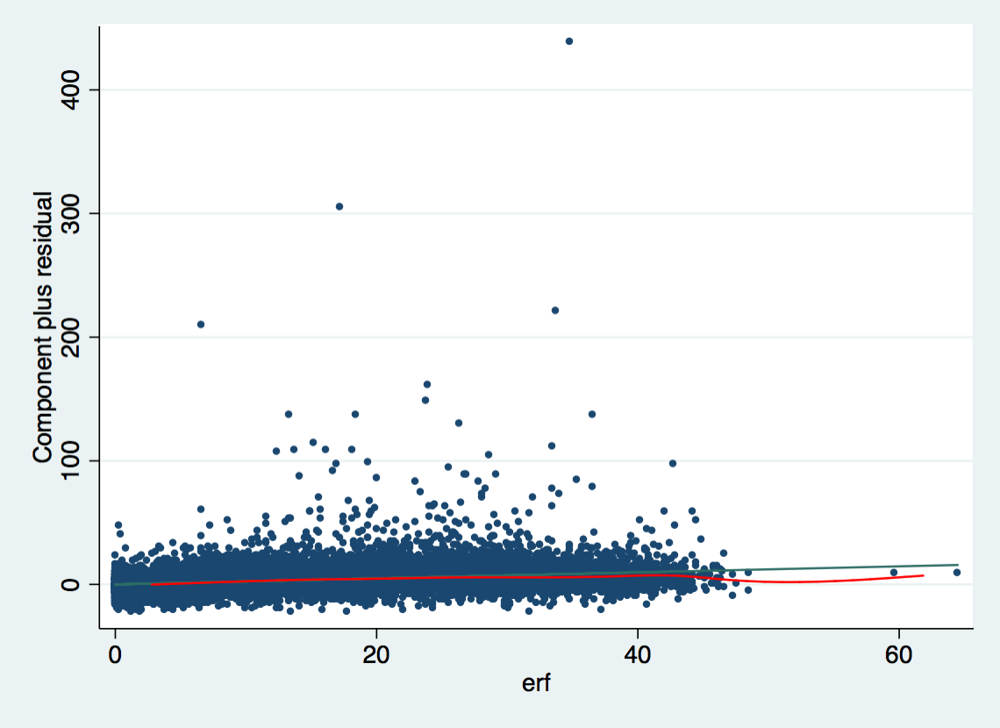

---
output:
  html_document:
    code_folding: hide
---

```{r setup, include=FALSE}
source("0_packages.R")
source(".statapath.R")

knitr::opts_chunk$set(echo = TRUE, cache = T, warning = F)
```

# Exercise 2 {.tabset}

## Questions
- 2.1    Estimate a Linear Regression with SOEP Data using hourly wage `hwageb` as dependent variable for the year 2015. Include years of schooling `pgbilzeit` and work experience `erf` as predictor variables and gender `frau` and region `ost` as additional controls. 

- 2.2    Interpret the coefficients and the value of R²

- 2.3    Is the relationship between work experience and wage linear?

- 2.4    Specifiy the same regression model but use the natural logarithm as dependent variable instead. 

- 2.5    How large is the gender pay gap?

## Data Prep {.tabset}
### Stata
```{r stata data prep, results = T, engine = "stata", engine.path= statapath, comment = ""}
use "_data/ex_mydf.dta", clear

* Unplausible Beobachtungen identifizieren
********************************************************************************
      twoway (scatter hwageb pgtatzeit, msymbol(point) jitter(2))

* Visualize Income
********************************************************************************
      histogram hwageb if asample==1, bin(25)
	sum hwageb if asample==1, d
	twoway (scatter hwageb pgtatzeit, msymbol(point) jitter(2)) if asample==1
      
```

### R {.tabset}
#### Load Data
```{r load data}
ex_mydf <- readRDS(file = "_data/ex_mydf.rds")

asample <- ex_mydf %>% 
        filter(pgtatzeit >= 6,
               !is.na(pgtatzeit),
               alter %>% dplyr::between(18, 65),
               !is.na(alter),
               pgemplst %in% c(1,2,4),
               pop < 3
               )  %>%
      # filter unplausible cases
      mutate(na = case_when(
              pid %in% c(1380202, 1380202, 607602, 2555301) ~ 1,
              pid == 8267202 & syear == 2007 ~ 1,
              pid == 2633801 & syear == 2006 ~ 1,
              pid == 2582901 & syear > 2006 ~ 1 )
             ) %>% 
      filter(is.na(na)) %>% 
      select(hwageb, pgbilzeit, cpgbilzeit, erf, cerf, frau, ost, phrf, syear )

asample15 <- asample %>% filter(syear == 2015)
```

#### Descriptive Pre - Analysis
##### unplausible Cases
```{r unplausible cases ex2}
# to do: show id if wage above 600
ex_mydf %>% 
      select(pgtatzeit, hwageb) %>% 
      drop_na() %>% 
  ggplot(aes(x=pgtatzeit, y=hwageb)) + 
        geom_point(position = "jitter", size = 0.21)

  # nochmal scatter
  ggplot(asample, aes(x=pgbilzeit, y=hwageb)) + 
        geom_point(position = "jitter", size = 0.21,
                   na.rm = T)
```

##### visualize Income {.tabset}
###### Histogram
```{r viz income ex2}
  summary(asample$hwageb)
  
  qplot(hwageb, geom="histogram",
        binwidth = 25,  
        main = "Histogram for Hourly Wage", 
        xlab = "Hourly Wage in Prices from 2015",  
        fill=I("grey"), 
        col=I("black"), 
        alpha= I(.2),
        xlim=c(0,500),
        ylim= c(0,125000),
        data = asample)
  
  # alternative
  # without ..density it would be counts
  g_hist_wage <- asample %>% 
        ggplot(aes(x = hwageb, y = ..density..)) +
        geom_histogram(breaks = seq(0,767.4, by = 25)) + 
        labs(title="Histogram for Hourly Wage in 2015 Prices",
             x="Hourly Wage")
  
  g_hist_wage
  
  hist(asample$hwageb, probability = T)
```

##### for 2015
summary of hourly wage and yrs of schooling, work exp, etc.
```{r analysis for 2015}
  asample %>%
      filter(syear == 2015) %>% 
      select(hwageb, pgbilzeit, erf, frau, ost) %>%
      drop_na() %>%  # optional if complete.obs is specified
      cor(use = "complete.obs")
  
  asample %>%
        filter(syear == 2015) %>% 
        ggplot(aes(pgbilzeit, hwageb)) +
            geom_point(na.rm=T, position = "jitter")
```

## Answers  {.active}
### 2.1 Basic Model{.tabset}
**Estimate a Linear Regression with SOEP Data using hourly wage `hwageb` as dependent variable for the year 2015. Include years of schooling `pgbilzeit` and work experience `erf` as predictor variables and gender `frau` and region `ost` as additional controls**. 

***

Note: STATA command if e(sample): *In STATA, there is a practical command if e(sample) that lets you restrict new calculations to the observations that were used in a model calculated before. In this exercise this can be used to calculate centralized coefficients for education and compare two models with each other, making sure that they are based on the same observations. In this exercise, the basic model is calculated first (2.1) and then another model is run with the same sample, but with centralized years of education and work experience (2.1c) in order to be able to interpret the intercept in a theoretically coherent way.*

Note2: STATA - R Difference concerning weights in regression models. *STATA and R handle weights with the value of 0 differently. While STATA drops these observations by default, R does not. In theory, weights of 0 should not exist, because sampling weights are supposed to be the inverse of the probability of being sampled. In survey data, sampling weights of 0 can be included because the weights are adjusted in various ways. If you want to include cases with 0 weights in STATA regressions you need to use the svy option as described [here](https://www.stata.com/support/faqs/statistics/svy-and-zero-weights/). If, on the other hand you want to exclude them from the R model, you can use a filter before modeling (e.g. `filter(phrf > 0)`). For the basic model in this exercise both ways are shown here (First without 0-weight observations, then with).*

#### Stata {.tabset}
##### basic model 

without weights0 cases:

      Linear regression                         Number of obs     =     14,218
                                                F(4, 14213)       =     259.84
                                                Prob > F          =     0.0000
                                                R-squared         =     0.2253
                                                Root MSE          =     10.072

      ------------------------------------------------------------------------------
                   |               Robust
            hwageb |      Coef.   Std. Err.      t    P>|t|     [95% Conf. Interval]
      -------------+----------------------------------------------------------------
         pgbilzeit |   1.638184   .0619018    26.46   0.000     1.516848     1.75952
               erf |   .2431915   .0109426    22.22   0.000     .2217425    .2646405
              frau |  -2.754198   .2425546   -11.35   0.000    -3.229636   -2.278759
               ost |  -4.278906   .2718054   -15.74   0.000     -4.81168   -3.746132
             _cons |  -6.573576   .7699179    -8.54   0.000    -8.082716   -5.064436
      ------------------------------------------------------------------------------


Note: r markdown text with STATA output: *Here is an example where I copied the output of the STATA regression into the R markdown in order to make it easy to compare it to the R output in the next tab. Because the STATA implementation in R markdown is not perfect yet, you cannot print single things in specific places but only run the code and see all of the output afterwards --> see tab "full code". (This is partly due to the fact that R runs STATA from shell and certain features are not available there).*

##### basic model II
with weights0 cases:

      Survey: Linear regression
      
      Number of strata   =         1                 Number of obs     =      14,300
      Number of PSUs     =    14,300                 Population size   =  33,885,938
                                                     Design df         =      14,299
                                                     F(   4,  14296)   =      259.86
                                                     Prob > F          =      0.0000
                                                     R-squared         =      0.2253
      
      ------------------------------------------------------------------------------
                   |             Linearized
            hwageb |      Coef.   Std. Err.      t    P>|t|     [95% Conf. Interval]
      -------------+----------------------------------------------------------------
         pgbilzeit |   1.638184   .0618931    26.47   0.000     1.516866    1.759503
               erf |   .2431915   .0109411    22.23   0.000     .2217455    .2646375
              frau |  -2.754198   .2425205   -11.36   0.000    -3.229569   -2.278826
               ost |  -4.278906   .2717671   -15.74   0.000    -4.811605   -3.746207
             _cons |  -6.573576   .7698095    -8.54   0.000    -8.082503    -5.06465
      ------------------------------------------------------------------------------
Note: r markdown text with STATA output: *Here is an example where I copied the output of the STATA regression into the R markdown in order to make it easy to compare it to the R output in the next tab. Because the STATA implementation in R markdown is not perfect yet, you cannot print single things in specific places but only run the code and see all of the output afterwards --> see tab "full code". (This is partly due to the fact that R runs STATA from shell and certain features are not available there).*

##### centered model 
without weights0 cases:

      Linear regression                         Number of obs     =     14,218
                                                F(4, 14213)       =     259.84
                                                Prob > F          =     0.0000
                                                R-squared         =     0.2253
                                                Root MSE          =     10.072

      ------------------------------------------------------------------------------
                   |               Robust
            hwageb |      Coef.   Std. Err.      t    P>|t|     [95% Conf. Interval]
      -------------+----------------------------------------------------------------
        cpgbilzeit |   1.638184   .0619018    26.46   0.000     1.516848     1.75952
              cerf |   .2431915   .0109426    22.22   0.000     .2217425    .2646405
              frau |  -2.754198   .2425546   -11.35   0.000    -3.229636   -2.278759
               ost |  -4.278906   .2718054   -15.74   0.000     -4.81168   -3.746132
             _cons |   18.51181   .2143393    86.37   0.000     18.09168    18.93194
      ------------------------------------------------------------------------------      

Note: r markdown text with STATA output: *Here is an example where I copied the output of the STATA regression into the R markdown in order to make it easy to compare it to the R output in the next tab. Because the STATA implementation in R markdown is not perfect yet, you cannot print single things in specific places but only run the code and see all of the output afterwards --> see tab "full code". (This is partly due to the fact that R runs STATA from shell and certain features are not available there).*

##### centered model II
with weights0 cases:

      Survey: Linear regression
      
      Number of strata   =         1                 Number of obs     =      14,300
      Number of PSUs     =    14,300                 Population size   =  33,885,938
                                                     Design df         =      14,299
                                                     F(   4,  14296)   =      259.86
                                                     Prob > F          =      0.0000
                                                     R-squared         =      0.2253
      
      ------------------------------------------------------------------------------
                   |             Linearized
            hwageb |      Coef.   Std. Err.      t    P>|t|     [95% Conf. Interval]
      -------------+----------------------------------------------------------------
        cpgbilzeit |   1.638184   .0618931    26.47   0.000     1.516866    1.759503
              cerf |   .2431915   .0109411    22.23   0.000     .2217455    .2646374
              frau |  -2.754198   .2425205   -11.36   0.000    -3.229569   -2.278826
               ost |  -4.278906   .2717671   -15.74   0.000    -4.811605   -3.746207
             _cons |   18.51659   .2143495    86.39   0.000     18.09644    18.93674
      ------------------------------------------------------------------------------
      


Note: r markdown text with STATA output: *Here is an example where I copied the output of the STATA regression into the R markdown in order to make it easy to compare it to the R output in the next tab. Because the STATA implementation in R markdown is not perfect yet, you cannot print single things in specific places but only run the code and see all of the output afterwards --> see tab "full code". (This is partly due to the fact that R runs STATA from shell and certain features are not available there).*

##### Full Code
```{r stata 2.1, results = T, engine = "stata", engine.path= statapath, comment = ""}
use "_data/ex_mydf.dta", clear

* 2.1 basic model, no 0-weights
********************************************************************************
reg hwageb pgbilzeit erf frau ost if asample==1 & syear==2015 [pw=phrf] 

* sum bildungszeit only for sample of last estimation
cap drop cpgbilzeit
sum pgbilzeit if e(sample)
gen cpgbilzeit = pgbilzeit - r(mean)

cap drop cerf
sum erf if e(sample)	
gen cerf = erf -r(mean)

sum pgbilzeit cpgbilzeit if e(sample)
sum erf cerf if e(sample)
	
* 2.1c model with centered predictors, no 0-weights
reg hwageb cpgbilzeit cerf frau ost if asample==1 & syear==2015 [pw=phrf]


* 2.1 basic model, with 0-weights
********************************************************************************
svyset [pw=phrf]

svy: reg hwageb pgbilzeit erf frau ost if asample==1 & syear==2015 

* sum bildungszeit only for sample of last estimation
cap drop cpgbilzeit
sum pgbilzeit if e(sample)
gen cpgbilzeit = pgbilzeit - r(mean)

cap drop cerf
sum erf if e(sample)	
gen cerf = erf -r(mean)

sum pgbilzeit cpgbilzeit if e(sample)
sum erf cerf if e(sample)
	
* 2.1c model with centered predictors, with 0-weights
svy: reg hwageb cpgbilzeit cerf frau ost if asample==1 & syear==2015
```


#### R {.tabset .active}
##### Models {.tabset}
###### basic model 
without weights0 cases
```{r fit 2.1}
# fit regression model
  # automatically drops rows with missing values
  fit2.1_no0w <- asample15 %>%
      # filter sample weights = 0
      filter(phrf > 0) %>% 
      lm(hwageb ~ pgbilzeit + erf + frau + ost, 
         data= ., weights = phrf)
  
  tidy(fit2.1_no0w, conf.int = T)
  glance(fit2.1_no0w)
  # summary(fit2.1_no0w)
  
  # with robust standard errors
  tidy(coeftest(fit2.1_no0w, vcov = vcovHC(fit2.1_no0w, "HC1")))   # robust; HC1 (Stata default)
```

###### basic model II
with weights0 cases
```{r fit 2.1 with 0 weights obs}
# fit regression model
  # automatically drops rows with missing values
  fit2.1 <- asample15 %>%
      lm(hwageb ~ pgbilzeit + erf + frau + ost, 
         data= ., weights = phrf)
  
  tidy(fit2.1, conf.int = T)
  glance(fit2.1)
  # summary(fit2.1)
  
  coeftest(fit2.1, vcov = vcovHC(fit2.1, "HC1"))    # robust; HC1 (Stata default)
```

###### centered model
- without weights0 cases

- with centralized years of schooling and work experience. This can be helpful to interpret the intercept, because 0 years education are not a realistic interpretation

Note: STATA command if e(sample) implementation in R. *In order to achieve the same effect of the if e(sample) addition in STATA, one can store the rownames of the observations in the fitted model and use these to filter the dataset that the next model is based on (or for whichever computation this restriction is needed).*

```{r fit 2.1c}
esample <- rownames(as.matrix(resid((fit2.1_no0w))))

# regress again with centered predictors
fit2.1c_no0w <-  asample15 %>% 
  # filter only obs used in last model
  filter(row_number() %in% esample) %>%
  # centralized values for education by year
  mutate(cpgbilzeit = pgbilzeit - mean(pgbilzeit, na.rm = T),
         cerf = erf - mean(erf, na.rm = T)) %>% 
  # linear model
  lm(hwageb ~ cpgbilzeit + cerf + frau + ost,
     data= ., weights = phrf)
  
  tidy(fit2.1c_no0w)
  coeftest(fit2.1c_no0w, vcov = vcovHC(fit2.1c_no0w, "HC1"))    # robust; HC1 (Stata default)
  # Sample identifier, a set of row names which can be used to subset the corresponding dataframe
```

Number of Observations in the sample
```{r}
length(esample)
```

###### centered model II
with weights0 cases
```{r}
# Sample identifier, a set of row names which can be used to subset the corresponding dataframe
esample <- rownames(as.matrix(resid((fit2.1))))

# regress again with centered predictors
fit2.1c <-  asample15 %>% 
  # filter only obs used in last model
  filter(row_number() %in% esample) %>%
  # generate centralized values for education by year
  mutate(cpgbilzeit = pgbilzeit - mean(pgbilzeit, na.rm = T),
         cerf = erf - mean(erf, na.rm = T)) %>% 
  # linear model
  lm(hwageb ~ cpgbilzeit + cerf + frau + ost,
     data= ., weights = phrf)
  
  tidy(fit2.1c)
  coeftest(fit2.1c, vcov = vcovHC(fit2.1c, "HC1"))    # robust; HC1 (Stata default)
  
  # summary statistics of education and job experience with sample of last regression
  asample15 %>%
        filter(row_number() %in% esample) %>% # this needs to be in a separate filter, otherwise wont work
        select(pgbilzeit, erf) %>%
        stat.desc(basic = T)
```

Number of Observations in the sample
```{r}
length(esample)
```

##### Plots
```{r plot fit2.1, fig.width=4, fig.height = 3}
# plot it 
  asample %>% 
      filter(syear == 2015) %>% 
      ggplot(aes(pgbilzeit, hwageb)) + 
      geom_point() + 
      geom_smooth(method="lm", color="red", se=F) +
      geom_line(aes(y = mean(asample$hwageb)), color="blue")
```

This code produces a set of four plots: residuals versus fitted values, a Q-Q plot of standardized residuals, a scale-location plot (square roots of standardized residuals versus fitted values) and a plot of residuals versus leverage that adds bands corresponding to Cook's distances of 0.5 and 1.
The par option is specified, in order to display all four of them at once and not in separate steps. This option is revoked afterwards. You can type ?par into R to learn more.
```{r plot2 fit2.1}
par(mfrow=c(2,2))
plot(fit2.1)
par(mfrow=c(1,1))
```

##### More Info {.tabset}
More Information about single parts of the model(s).

These are quick ways to extract the confidence intervals, intercept and slopes of a model:
```{r CI fit2.1}
# extract Confidence Intervals
      confint(fit2.1)
# extract intercept
      fit2.1$coef[1]
# extract slope
      fit2.1$coef[2:5]
# extract the names of the content in your model
      names(fit2.1)
```

### 2.2 coefficients and R² {.tabset}
**Interpret the coefficients and the value of R² **

***

**Model 2.1 Coefficients**

- Intercept
- The intercept is negative, which does not make theoretical sense because wages cannot be negative. Mathematically it reflects the predicted value if all explanatory variables are equal to 0. Since there is "Schulpflicht" in Germany, it is not the case that there are people with no education at all in the dataset. Since there are no observations with education < 7, the model cannot predict those cases successfully. In order to be able to interpret the intercept after all, one can center the variables.
      
- Years of Education (`pgbilzeit`)
      - For each unit (year) increase of education, hourly wage is expected to increase by 1.64 units (Euro).

- Work Experience (`erf`)
      - For each increase of working experience by one year, the expects income increases by 0,24 Euro/hour. 
      
- Gender (`frau`)
      - Women are expected to earn 2.75 Euro less per hour compared to men.
      
- Region (`ost`)
      - People who grew up in former eastern germany are estimated to earn 4.26 Euro less, compared to people who grew up in former western Germany.
      
- R-squared
      - The model can explain 22.59% of the overall variance of hourly wages in Germany.

**Model 2.1c Coefficients**

- Intercept
- With the variables education and work experience centered, one can interpret the intercept as: For male Germans (`frau` == 0) who were born in former West Germany (`ost` == 0) and with average years of education (`cpgbilzeit`) and average years of work experience (`cerf`), the expected hourly wage is 18,51 Euro/h. 

- One can now also predict the wages for other groups by adding the values of the coefficients and the intercept. E.g. The model predicts hourly wages of `18.51 - 2.75 = 15.76` Euro/h for females compared to 18.51 Euro/h for males, holding education and work experience equal.
      

### 2.3 work experience and wage {.tabset}
Is the relationship between work experience and wage linear?

***

Labor market research found that the relationship of work and wage is not linear. In the cprplots one can see the that model that assumes linearity systematically overestimates people with long work experience. The solution to this would be to use the squared term of work experience in the model.


#### Stata
```{r stata marginsplot_2_3, out.width = "400px"}

```

```{r stata marginsplot_2_32, out.width = "400px"}
knitr::include_graphics("out/cpr_2_32.png")
```

```{r stata 2.3, results = T, engine = "stata", engine.path= statapath, comment = ""}
	
use "_data/ex_mydf.dta", clear

	reg hwageb i.frau pgbilzeit erf ost if asample==1 & syear==2015 [pw=phrf] 
	
	cprplot erf, msize(vsmall) jitter(2) mspline msopts(bands(11) lcolor(red)) name(cpr_2_3, replace)
	
	graph use cpr_2_3
	graph export "out/cpr_2_3.png", replace
	
      reg hwageb i.frau##c.pgbilzeit c.erf##c.erf ost if asample==1 & syear==2015 [pw=phrf] 
	cprplot erf, msize(vsmall) jitter(2) mspline msopts(bands(11) lcolor(red)) name(cpr_2_32, replace)
	
	graph use cpr_2_32
	graph export "out/cpr_2_32.png", replace
	
```

#### R {.tabset .active}
##### Models
###### Base Model
```{r}
# base model
  fit2.3 <- asample%>% 
      filter(syear == 2015) %>%
      lm(hwageb ~ frau + pgbilzeit + erf + ost, 
                      data= ., weights = phrf)
  
  tidy(fit2.3)
```

###### Model with squared experience
```{r}
  fit2.3_exp <- asample %>%
       filter(syear == 2015) %>%
       mutate(frau.d = factor(frau)) %>% 
       lm(hwageb ~ frau + pgbilzeit + erf + I(erf^2) + ost, 
          data= ., weights = phrf)
  
  tidy(fit2.3_exp)
  
```

##### Plots

Component + Residual Plot 
Note: These plots are not available if there is an interaction term in the model formula. It does work, if the interaction term is stored in an extra variable
```{r, out.width = "400px"}
  crPlots(fit2.3, terms = .~ erf, layout = c(1,1))

```

```{r, out.width = "400px"}
fit2.3_exp <- asample %>%
       filter(syear == 2015) %>%
       mutate(erfq = erf*erf) %>% 
       lm(hwageb ~ frau + pgbilzeit + erf + erfq + ost, 
          data= ., weights = phrf)

  crPlots(fit2.3_exp, terms = .~ erf, layout = c(1,1))

```

### 2.4 Log Model {.tabset}
Specifiy the same regression model but use the natural logarithm as dependent variable instead.
How does the the interpretation of coefficients change?

***

**Why use log of wage?** Hourly wage is very right skewed while the log(wage) is closer to a normal distribution. Since the dependent variable is now the log, it is not very intuitive to interpret.

How does the the interpretation of coefficients change?
 - before we had additive model now its a multiple model
 - you can be interpreted as percentage change
      - `dis exp(.0868897)`	
 	- e.g. 1.09 -> for every more year of education, expected wage is raised by 9%
 - change after 8 years:
 	`dis exp(.0868897)^8` = 2,003 -> 100% increase
 	
#### Stata
```{r stata 2.4, results = T, engine = "stata", engine.path= statapath, comment = ""}

use "_data/ex_mydf.dta", clear
	
* Mincer-Equation
	reg lnhwageb pgbilzeit erf frau ost if asample==1 & syear==2015 [pw=phrf]
	
* Standardization
      reg hwageb pgbilzeit frau erf ost if asample==1 & syear==2015 [pw=phrf], beta
      
      dis exp(.0868897)	// 0.08.. if coef. of yrs of education is constant
      dis  .3956569^2	// (beta coeff of yrs of education squared)
```
#### R {.tabset .active}
##### Models
###### Mincer Model
```{r}
 fit2.4 <- asample %>% 
        # filter because income variable has 0's
        filter(syear == 2015,
               hwageb > 0) %>% 
        lm(log(hwageb) ~ pgbilzeit + erf + frau + ost,
           data = ., weights = phrf)

 tidy(fit2.4)
```

###### Coefficients
How does the the interpretation of coefficients change?
-> before we had additive model now its a multiple model you can interpret this as percentage change
Example:
1.09 -> for every more year of education, expected wage is raised by 9%
```{r}
  exp(.0868897)	# 0.08.. if coef. of yrs of education
```
  
if you want to know the change after 8 years:
```{r}
   exp(.0868897)^8   # 2,003 -> 100% increase
```

###### standardization
if you standardize you do it on both sides of the equations, (add , beta to command) then they are called beta- coeff.

interpretation: change of y in terms of its SD when x changes by 1 SD  what is it useful for?
 - how to get them?
 - is good to interpret how large the effect is the square of beta coef. tell you portion of variance axplained by  var of variable
 
 - 15 % of wage is due to variation in bilzeit issues, you can only do than in one model, not compare across models if you have interaction in your model, can (not?) interpret beta's
 
 - standardization:
      - if you standardize you do it on both sides of the equations, (add , beta to command) then coefficients are called beta- coeff.
 	- interpretation: change of y in terms of its SD when x changes by 1 SD
 	- what is it useful for?
 	- how to get them
 		- is good to interpret how large the effect is
 		- the square of beta coef. tell you portion of variance axplained by  var of variable
 		- `dis  .3956569^2`	(beta coeff of yrs of education squared)
 	- 15 percent of wage is due to variation in years if education
 	- issues, you can only do than in one model, not compare across models
 	- if you have interaction in your model, can (not?) interpret beta's

```{r}
 # to do: betas
   # reg hwageb pgbilzeit frau erf ost if asample==1 & syear==2015 [pw=phrf], beta 

  .3956569^2	# beta coeff of yrs of education squared
```


### 2.5 Gender Pay Gap {.tabset}
How large is the gender pay gap?

***

to do: write answer

#### Stata
```{r stata 2.5, results = T, engine = "stata", engine.path= statapath, comment = ""}
use "_data/ex_mydf.dta", clear

reg lnhwageb ost frau pgbilzeit c.erf##c.erf pgexpue if asample==1 & syear==2015 [pw=phrf]
margins  , at(erf=(0(5)50) pgbilzeit=(8 13 18))
marginsplot
dis exp(-.1437791)

* raw gap
reg lnhwageb frau if asample==1 & syear==2015 [pw=phrf]
dis exp(-.1983373)

```
#### R {.tabset .active}
##### Models
```{r}
    # reg lnhwageb ost frau pgbilzeit c.erf##c.erf pgexpue if asample==1 & syear==2015 [pw=phrf]
    # margins  , at(erf=(0(5)50) pgbilzeit=(8 13 18))
    # marginsplot
    exp(-.1437791)
    # 
    # * raw gap
    # reg lnhwageb frau if asample==1 & syear==2015 [pw=phrf]
    # 
    exp(-.1983373)
```

  

 
