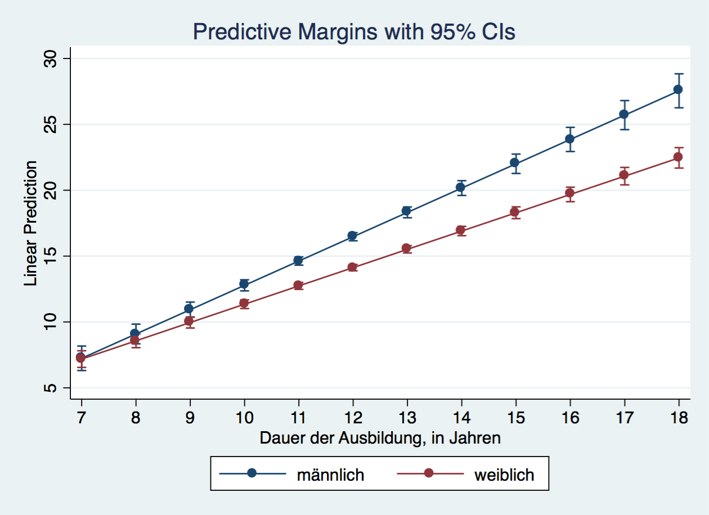
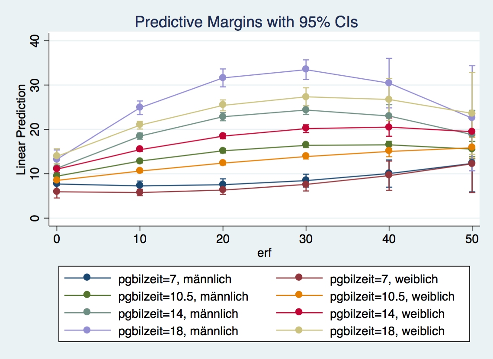
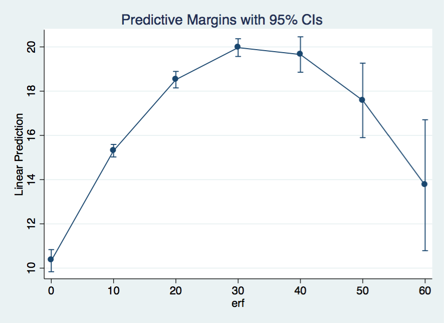
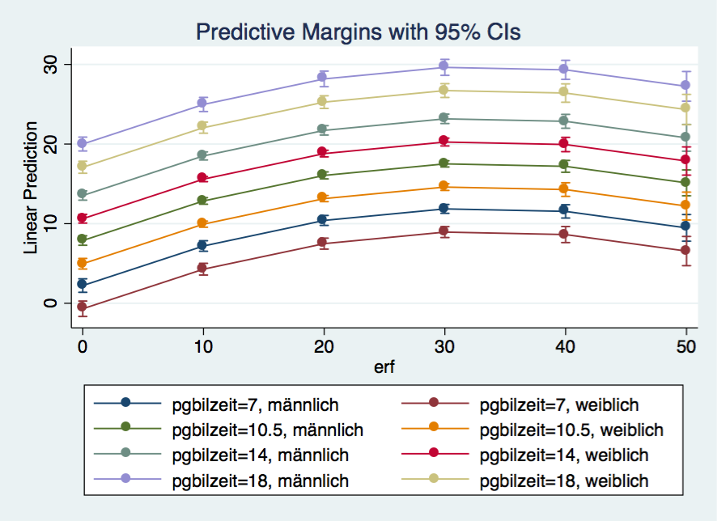

---
output:
  html_document:
    code_folding: hide
---

```{r setup, include=FALSE}
source("0_packages.R")
source(".statapath.R")

knitr::opts_chunk$set(echo = TRUE, cache = T)

```

# Exercise 3 {.tabset}
## Questions

3.1 You should start with an income equation with hourly gross wages (do not use the log-transfromation for now). Predictor variables are years of education, labor force experience, sex and region.

3.2 Specify an interaction effect for sex and years of education. Interpret the results.

3.3 Present your results grafically using a marginal effects plot

3.4 Specify another interaction effect between years of education and labor force experience. Interpret the results. Use a marginal effects plot to do that.

3.5 Include a nominal (e. g. company size: pgallbet) variable with more than two categories as predictors using a dummy set.

3.6 Drop the interactions and the dummy set. Include duration of unemployment as additional predictor. What has the largest effect, years of education, labor force experience or duration of unemployment?

3.7 Specify a quadratic effect for labor force participation. Interpret the result using a marginal effects plot.

3.8 Now, use log-transformed income as dependent variable. Interpret the effect of years of education on income. Present your result in a table using estout or esttab.

## Data Prep {.tabset}
### Stata

```{r stata create and clean, results = T, engine = "stata", engine.path= statapath, comment = ""}
set more off
capt clear
version 14

use "_data/ex_mydf.dta", clear
```

### R
#### Load Data
```{r load data, code_folding = show}
#### load dataset ####
ex_mydf <- readRDS(file = "_data/ex_mydf.rds")

asample <- ex_mydf %>% 
        filter(pgtatzeit > 5,
               alter %>% dplyr::between(18, 65),
               pgemplst %in% c(1,2,4),
               pop<3
               ) %>% 
      # filter unplausible cases
      mutate(na = case_when(
              pid %in% c(1380202, 1380202, 607602, 2555301) ~ 1,
              pid == 8267202 & syear == 2007 ~ 1,
              pid == 2633801 & syear == 2006 ~ 1,
              pid == 2582901 & syear > 2006 ~ 1 )
             ) %>% 
      filter(is.na(na)) %>% 
## Sample For Analysis for 2015
asample15 <- asample %>% filter(syear == 2015)
```

## Answers {.active}
### 3.1 Basic Model {.tabset}
You should start with an income equation with hourly gross wages `hwageb` (do not use the log-transfromation for now). Predictor variables are years of education `pgbilzeit`, labor force experience `erf`, sex `frau` and region `ost`.

***

#### Stata
```{r stata 3.1, results = T, engine = "stata", engine.path= statapath, comment = ""}
use "_data/ex_mydf.dta", clear

reg hwageb pgbilzeit erf frau ost if asample==1 & syear==2015 [pw=phrf]
* reg hwageb pgbilzeit c.erf##c.erf frau ost if asample==1 & syear==2015 [pw=phrf]

```
 
#### R {.tabset .active}
##### version 1 
Overview of model with summary()
```{r model 3.1}
fit3.1  <- asample15 %>% 
            lm(hwageb~ pgbilzeit + erf + ost + frau, data=., weights=phrf)

summary(fit3.1)
```

##### version 2 {.active}
Overview of model with `broom` package
```{r}
# overall model
glance(fit3.1)

# model coefficients
tidy(fit3.1, conf.int = T)
```

### 3.2 Interaction {.tabset}
Specify an interaction effect for sex and years of education. Interpret the results.

***
In the prior model, with only main effects, we could interpret the gender variable `frau` as the difference between females (1) and males (0). Now that we added the interaction term, we allow the slopes for years of education to differ between females and males. The presence of the interaction implies that the effect of education depends on the gender of a person. The term frau:pgbilzeit indicates the extend to which the difference between females and males changes for every year of education. The coefficient for years of education `pgbilzeit` indicates the effect of education on hourly wages for males (reference category: `frau == 0`). The model predicts that for every increase of education by one unit (year), hourly wage increases by 1.84 € for males and by 1.84 € - 0.46 € = 1.38 € for females (all other factors held constant). 

This is visualized in the following plots of exercise 3.3.

#### Stata
```{r stata 3.2, results = T, engine = "stata", engine.path= statapath, comment = ""}
use "_data/ex_mydf.dta", clear

reg hwageb i.frau##c.pgbilzeit erf ost if asample==1 & syear==2015 [pw=phrf]
```

#### R {.tabset .active}
```{r model 3.2}
fit3.2 <- asample15 %>%
      select(hwageb, pgbilzeit, frau, erf, ost, phrf) %>% 
      drop_na %>% 
      lm(hwageb ~ frau*pgbilzeit + erf + ost, data= ., weights = phrf)

# overall model
glance(fit3.2)

# model coefficients
tidy(fit3.2, conf.int = T)
```

### 3.3 Marginal Effects {.tabset}
Present your results grafically using a marginal effects plot.

***

#### Stata
```{r stata marginsplot_3_3, out.width = "600px"}

```

```{r stata 3.3, results = F, engine = "stata", engine.path= statapath, comment = ""}
use "_data/ex_mydf.dta", clear

reg hwageb i.frau##c.pgbilzeit erf ost if asample==1 & syear==2015 [pw=phrf]

qui: margins, at(pgbilzeit=(7 (1) 18) frau=(1 0))
marginsplot, name(margins_3_3, replace)

graph use margins_3_3
graph export "out/margins_3_3_text.png", replace
```


#### R {.tabset .active}
##### Plots
###### Marginsplot
```{r model 3.3, out.width = "600px"}
# Marginsplot for Years of Education and Gender
 dat <- ggpredict(fit3.2, terms = c("pgbilzeit", "frau"))

# fancy plot
 ggplot(dat, aes(x, predicted, color = group, fill = group)) +
       geom_line()+
       geom_point()+
       geom_ribbon(ggplot2::aes_string(ymin = "conf.low", 
                ymax = "conf.high", color = NULL), alpha = 0.25) +
       labs(x = get_x_title(dat), y = get_y_title(dat))+
       ggtitle("Predicted Values for Hourly Wages in Prices of 2015")+
       guides(fill = guide_legend(title="Gender"),color = F)+
       theme(legend.position="bottom")
 
# quick alternative
 plot(dat)
 
```

###### Coeff-Plots
```{r coef plots}
     # m = the object of a regression result
      # var1 = var whose coefficient is to be plotted 
      # var2 = var on which the coefficient is conditional (var2)
      
      # if we intend to know how the year of education can affect the coefficient for gender on the hourly wage, var1 is gender, and var2 is years of education. 
      
      # parameters:   point = wether a line or points are shown
      #               hist = it can be helpful to the evaluation of the substantive significance of the conditional effect to know the distribution of the conditioning variable (years of education)

interplot(m = fit3.2 , var1 = "frau", var2= "pgbilzeit", point = F, hist = T) +
            theme(axis.text.x  = element_text(angle=45)) +
            xlab("Education (in years)") +
            ylab("Estimated Coefficient for\nGender") +
            ggtitle("Effects of Education on Estimated Gender Coefficient") +
            theme(plot.title = element_text(face="bold")) +
            # Add a horizontal line at y = 0
            geom_hline(yintercept = 0, linetype = "dashed")

 # -> negative slope, shows that with increasing years of education(along the x axis), the magnitude of the coefficient of gender on the Hourly Wage increases (in the negative direction) (along the y axis).
      
# Similarly, to show how the gender affects the coefficient of years of education on hourly wage, one only needs to switch var1 and var2:
      
interplot(m = fit3.2 ,var1 = "pgbilzeit" , var2="frau")+
            ggtitle("Effects of Gender on Estimated Coefficient of Education")

# margins paket, passt margins von Stata an
```

### 3.4 Interaction II {.tabset}
Specify another interaction effect between years of education and labor force experience. Interpret the results. Use a marginal effects plot to do that.

***

#### Stata {.tabset}
##### Model
```{r stata 3.4, results = T, engine = "stata", engine.path= statapath, comment = ""}
use "_data/ex_mydf.dta", clear

reg hwageb i.frau##c.pgbilzeit c.pgbilzeit##c.erf ost if asample==1 & syear==2015 [pw=phrf]

qui: margins, at(erf=(0(10)50) pgbilzeit=(7, 10.5, 14, 18) frau=(1 0))
marginsplot, name(margins_3_4, replace)

graph use margins_3_4
graph export "out/margins_3_4.png"
```

Three way interaction
```{r stata 3.4, results = T, engine = "stata", engine.path= statapath, comment = ""}
reg hwageb i.frau##c.pgbilzeit  i.frau##c.erf##c.erf ost if asample==1 & syear==2015 [pw=phrf] 

qui: margins  , at(erf=(0(10)50) pgbilzeit=(7, 10.5, 14, 18) frau=(1 0))
marginsplot, name(margins_3_42)
	
graph use margins_3_42
graph export "out/margins_3_42.png", replace
```

##### Plot
two way interaction
```{r stata marginsplot_3_4, out.width = "600px"}
knitr::include_graphics("out/margins_3_4.png")
```

three way interaction
```{r stata marginsplot_3_4, out.width = "600px"}

```
#### R {.tabset .active}
##### Model
Fit 3.4
```{r model 3.4}
   fit3.4 <- asample15 %>% 
         lm(hwageb ~ frau*pgbilzeit + pgbilzeit*erf + ost,
            data = ., weights = phrf)   
 
tidy(fit3.4)
glance(fit3.4)
```

##### Plots {.tabset}
###### Marginal Effect Plot
```{r 3.4 marginal effects, out.width = "600px"}
# Marginsplot for Years of Education and Gender
 dat <- ggpredict(fit3.4, terms = c("erf [0,10,20,30,40,50]", "pgbilzeit [7,10.5,14,18]", "frau"))

 ggplot(dat, aes(x, predicted, color = group, fill = group, linetype = facet)) +
       geom_point()+
       geom_line()+
      geom_ribbon(ggplot2::aes_string(ymin = "conf.low", 
                ymax = "conf.high", color = NULL), alpha = 0.25)+
       labs(x = get_x_title(dat), y = get_y_title(dat))+
       ggtitle("Predicted Values for Hourly Wages in Prices of 2015")+
       theme(legend.position="bottom")+
       guides(fill = guide_legend(title="Years of Education"),
              linetype = guide_legend(title = "Gender"),
              color = F)

                
 # plot(dat, show.legend = F)+ 
 #       ggtitle("Predicted Values for Hourly Wages in Prices of 2015")+
 #       guides(fill=guide_legend(title="Years of Education"))
```

###### Coeff Plots
Marginal Effects of Work Experience
```{r 3.4 mariginal effects II}
# Marginal Effect of Work Experience
      interplot(m = fit3.4 ,var1 = "erf", var2 = "pgbilzeit", hist = T)  +
            xlab("Education (in years)") +
            ylab("Estimated Coefficient for\n Work Experience") +
            ggtitle("Estimated Coefficient of Work Experience conditional on Education") +
            theme(plot.title = element_text(face="bold")) +
            geom_hline(yintercept = 0, linetype = "dashed")
```

Marginal Effects of Education
```{r}
# Marginal Effects of Education
      interplot(m=fit3.4, var1 = "pgbilzeit", var2="erf", point = F, hist = T) +
      theme(axis.text.x  = element_text(angle=45)) +
      xlab("Education (in years)") +
      ylab("Estimated Coefficient for\n Education") +
      ggtitle("Estimated Coefficient of Education \n on Hourly Wage conditional on Work Experience") +
      theme(plot.title = element_text(face="bold")) +
      # Add a horizontal line at y = 0
      geom_hline(yintercept = 0, linetype = "dashed")

```

### 3.5 Nominal Variable {.tabset}
Include a nominal (e. g. company size: `pgallbet`) variable with more than two categories as predictors using a dummy set.

***

#### Stata
```{r, results = T, engine = "stata", engine.path= statapath, comment = ""}
use "_data/ex_mydf.dta", clear

recode pgallbet (5 = 0)			// selbstst. keine Angest. als Referenz
reg hwageb i.frau##c.pgbilzeit c.pgbilzeit##c.erf ost i.pgallbet if asample==1 & syear==2015 [pw=phrf]

* OR
cap drop d_allbet
tab pgallbet, gen(d_allbet_)
reg hwageb i.frau##c.pgbilzeit c.pgbilzeit##c.erf ost d_allbet_2 - d_allbet_5 if asample==1 & syear==2015 [pw=phrf]
```

#### R {.tabset .active}
```{r model 3.5}
if(!file.exists("out/fit3.5.rds")) {
      fit3.5 <- asample15 %>%
            lm(hwageb ~ pgbilzeit*frau + pgbilzeit*erf + ost + factor(pgallbet), 
               data = ., weights = phrf)
      saveRDS(fit3.5, "out/fit3.5.rds")
} else {
      fit3.5 <- readRDS("out/fit3.5.rds")
}

tidy(fit3.5, conf.int = T)
glance(fit3.5)

```

### 3.6 Partial Effect Size {.tabset}
Drop the interactions and the dummy set. Include duration of unemployment `pgexpue` as additional predictor. What has the largest effect, years of education `pgbilzeit`, labor force experience `erf` or duration of unemployment `pgexpue`

***
 
Years of education have the largest partial effect

#### Stata
```{r, results = T, engine = "stata", engine.path= statapath, comment = ""}
use "_data/ex_mydf.dta", clear

reg hwageb pgbilzeit erf pgexpue frau ost if asample==1 & syear==2015 [pw=phrf] , beta
```

#### R {.tabset .active}
```{r model 3.6}
fit3.6 <- asample15 %>% 
            lm(hwageb ~ pgbilzeit +  erf + pgexpue + frau + ost,
               data=., weights=phrf)
      
tidy(fit3.6)
glance(fit3.6)
      
anova(fit3.6)

# lm.beta package
# Doc: https://www.rdocumentation.org/packages/lm.beta/versions/1.5-1/topics/lm.beta
     lm.fit3.6.beta <- lm.beta(fit3.6)
     print(lm.fit3.6.beta)
     summary(lm.fit3.6.beta)
     coef(lm.fit3.6.beta)
```

### 3.7 Quadratic Effect {.tabset}
Specify a quadratic effect for labor force participation. Interpret the result using a marginal effects plot.

***

#### Stata {.tabset}

##### Model
```{r, results = T, engine = "stata", engine.path= statapath, comment = ""}
use "_data/ex_mydf.dta", clear

reg hwageb pgbilzeit c.erf##c.erf frau ost if asample==1 & syear==2015 [pw=phrf]

qui: margins, at(erf=(0(10)65))
marginsplot
graph export "out/margins_3_7.eps", replace

reg hwageb pgbilzeit c.erf##c.erf frau ost if asample==1 & syear==2015 [pw=phrf]

qui: margins, at(erf=(0(10)50) pgbilzeit=(7, 10.5, 14, 18) frau=(1 0))
marginsplot
graph export "out/margins_3_7_2.eps", replace

```

##### Plot
Marginsplot Work Experience Squared
```{r stata marginsplot_3_7, out.width = "600px", dev = "postscript"}

```

Margins Plot Work Experience Conditional on Education and Gender
```{r stata marginsplot_3_7_2, out.width = "600px"}

```

#### R {.tabset .active}
##### Models
Fit 3.7
```{r model 3.7}
fit3.7 <- asample15 %>%
                  lm(hwageb ~ pgbilzeit + erf + I(erf^2) + frau + ost, 
                     data=., weights=phrf)
      
tidy(fit3.7)
glance(fit3.7)
```

##### Plots
Margins Plot Work Experience
```{r}
 # for polynomial data
 dat <- ggpredict(fit3.7, terms = c("erf [0,10, 20, 30, 40, 50]"))

 ggplot(dat, aes(x, predicted)) +
       stat_smooth(se = FALSE) +
       geom_ribbon(aes(ymin = conf.low, ymax = conf.high), alpha = .15) +
       labs(x = get_x_title(dat), y = get_y_title(dat))
 
 plot(dat)
```

Margins Plot Work Experience Conditional on Education and Gender
```{r}
dat <- ggpredict(fit3.7, terms = c("erf [0,10,20,30,40,50]", "pgbilzeit [7,10.5,14,18]", "frau"))

ggplot(dat, aes(x, predicted, color = group, fill = group, linetype = facet)) +
       geom_point()+
       geom_line()+
      geom_ribbon(ggplot2::aes_string(ymin = "conf.low", 
                ymax = "conf.high", color = NULL), alpha = 0.25)+
       labs(x = get_x_title(dat), y = get_y_title(dat))+
       ggtitle("Predicted Values for Hourly Wage in Prices of 2015")+
       theme(legend.position="bottom")+
       guides(fill = guide_legend(title="Years of Work Experience"),
              linetype = guide_legend(title = "Gender"),
              color = F)
```


### 3.8 Log Transformation {.tabset}
Now, use log-transformed income `lnwage` as dependent variable. Interpret the effect of years of education `pgbilzeit` on income. Present your result in a table using estout or esttab.

***

#### Stata
```{r, results = T, engine = "stata", engine.path= statapath, comment = ""}
use "_data/ex_mydf.dta", clear

reg lnwage pgbilzeit c.erf##c.erf frau ost if asample==1 & syear==2015 [pw=phrf]
estimates store est1

* esttab
esttab

* estout
estout

* outreg
outreg2 est1 using "out/table3.8.xls", excel replace label alpha(0.001, 0.01, 0.05) bdec(3) eform stats(coef se)
```

#### R {.tabset .active}
```{r model 3.8}
fit3.8 <- asample15 %>%
      lm(lnwage ~ pgbilzeit + erf + I(erf^2) + frau + ost, 
         data=., weights=phrf)

tidy(fit3.8)
glance(fit3.8)
```

``` {r, results='asis'} 
stargazer(fit3.8, type = "html",
          title ="Regression Results", 
          dep.var.labels= c("Hourly Wages in Prices of 2015"),
          out = "out/model_3.8.txt")
```

